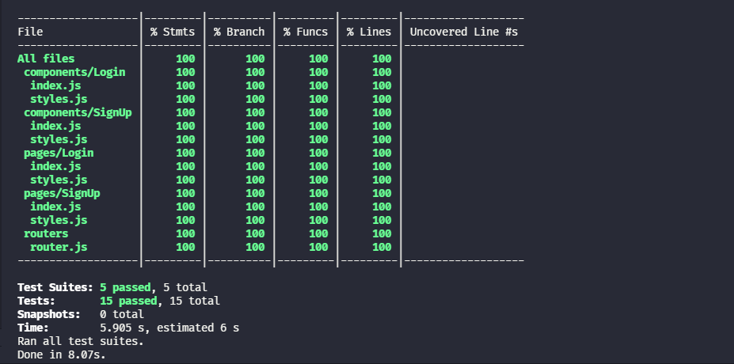

# Login Tdd

Login and Sign Up forms validation made using Tdd.

<p align="center">
    
    
</p>

## test coverage



## Techs

- React
- React-router-dom
- React-hook-form
- Styled-components
- Jest
- React-testing-library

## Run

to be able to run this project clone this repository in your terminal and then move to repository's folder, after that install all dependencies with the command bellow

```
npm install
```
or
```
yarn
```

after the instalation run the project with the command bellow

```
npm run start
```
or
```
yarn start
```

then type the following URL in your browser

```
http://localhost:3000
```

---
made by Washington Campos ❤️.